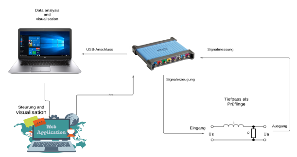
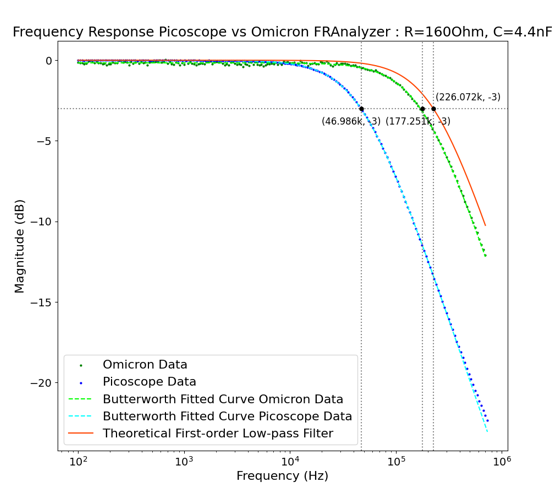
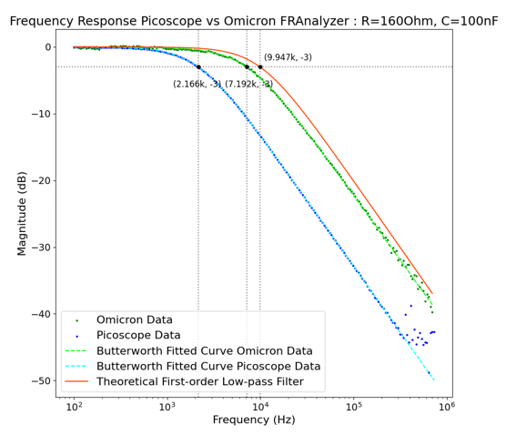

# Integrated PicoScope Python API and Frequency Analyzer Project

## Project Overview

This repository is dedicated to the development of two closely related projects focused on enhancing the interface and functionality of PicoScope devices for high-voltage engineering and power transmission applications. Our goal is to provide cost-efficient, user-friendly, and high-speed measurement solutions through innovative software solutions and hardware integration.

## Project Description

We are developing a cost-efficient frequency analyzer that utilizes a storage oscilloscope with an integrated signal generator. This analyzer is designed to be interfaced using Python APIs to create a seamless development experience. The system combines affordability with high measurement speed and includes an intuitive web interface for efficient control.

## Key Features

- **PicoScope Integration:** Utilizes the PicoScope device for data acquisition, forming the foundation of our self-developed Frequency Response Analyzer.
- **Python API Wrapper:** Simplifies communication between the application and PicoScope devices.
- **Web Interface:** An intuitive and responsive interface allows for convenient and efficient control.
- **FFT Analyzer:** Enables complex frequency domain analyses with a custom Fast Fourier Transform analyzer function.
- **Automatic Measurements:** Automatically measures the magnitude and phase of electrical circuits’ transfer functions.
- **Advanced Display Options:** Evaluates and displays transfer functions, Smith charts, and other relevant parameters.
- **Comprehensive Testing:** Ensures reliability and accuracy through rigorous testing.
- **Comparison with Real Devices:** Validates the output of the FFT analyzer by cross-verifying it with actual devices.

## Benefits

- **Cost Efficiency:** Offers a more economical alternative to existing frequency analyzers without compromising functionality.
- **Enhanced User Experience:** Focuses on user-friendliness with a straightforward and responsive interface.
- **Speed:** Provides rapid measurement capabilities to improve workflow efficiency significantly.

## Visual Documentation

### Setup and Frequency Analysis

#### Figure 1: Setup with PicoScope and Control via Notebook

### Comparison Results

#### Figure 2: Comparison of Frequency Responses - PicoScope vs. Omicron Network Analyzer (First Low-pass Filter)

#### Figure 3: Comparison of Frequency Responses - PicoScope vs. Omicron Network Analyzer (Second Low-pass Filter)

## Getting Started

To begin using this integrated system, follow the setup instructions below:

1. **Hardware Setup:** Ensure your PicoScope device is connected to your computer.
2. **Software Installation:** Download and install the necessary software from this repository.
3. **Web Interface Access:** Access the analyzer via the provided web link after installation.

## Future Scope

This project aims not only to fulfill current requirements but also to adapt to future needs as Pico Technology evolves, continually refining and expanding to support new functionalities.

## Disclaimer

This project is independent and is not affiliated with or endorsed by Pico Technology Ltd. It is an independent development aimed at enhancing high-voltage engineering applications.
